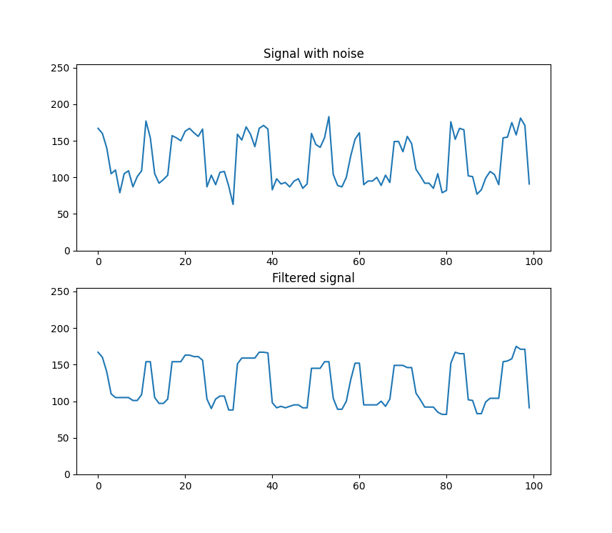

WIP

# Описание

Консольная утилита для Linux, которая реализует медианный фильтр.

На вход программы поступают бинарные данные в целочисленном формате.
На выход программы поступают бинарные данные в том же формате.

# Использование

-h (help):
```bash
$ ./median_filter -h
median_filter [-i input-file] [-o output-file] [-w window-size] [-h]
```

Пример (см. `/utils`):
```bash
.../out$ python ../utils/get_signal.py in | ./median_filter -w 3 -b 128 > out

.../out$ python ../utils/plot_signal.py in out
```

